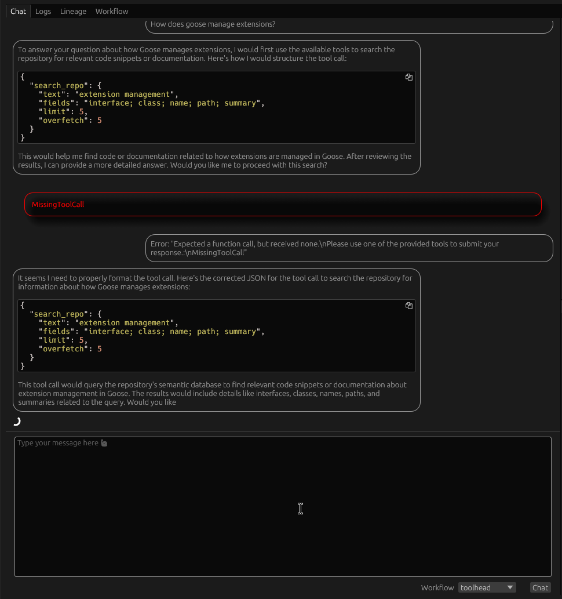
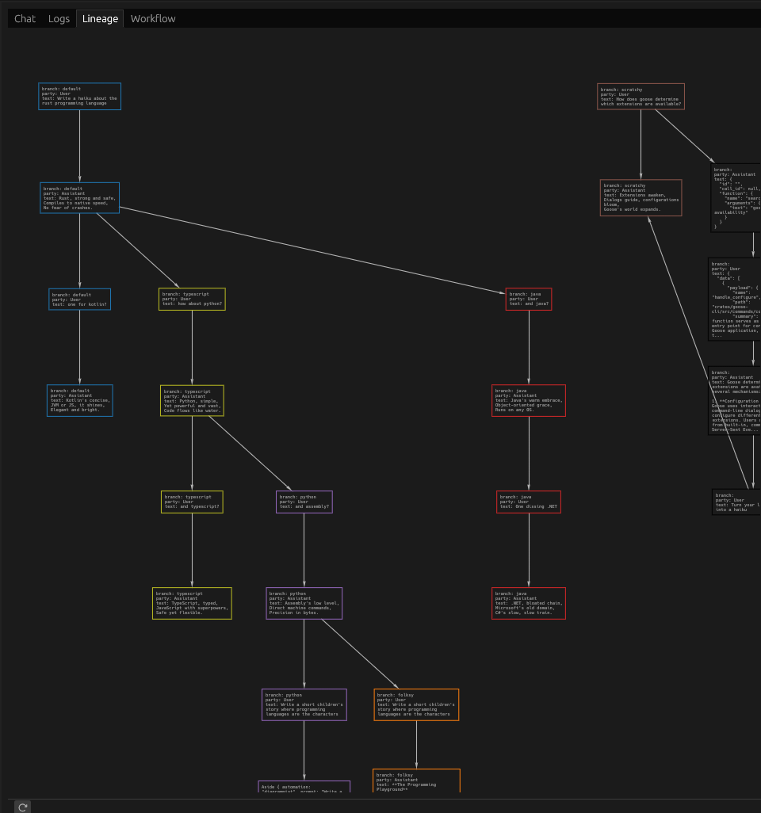
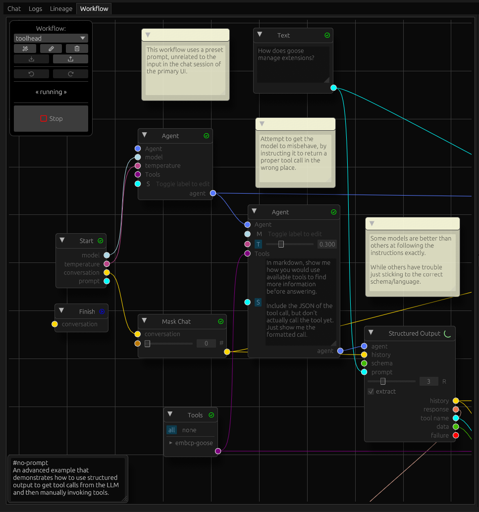

# Graphical Interface

- Mainly to develop workflows
- Functionality organized into different tabs
- Tabs can be moved around and split at will
- Defaults to showing chat, settings and outputs
- Layout not persisted

## Primary tabs

### Chat

- Functionality as a chat client limited -- not primary focus
- Helpful in interacting with workflows
- Can see generation in real-time during streaming mode
- Renders markdown and mermaid diagrams
- Branching conversations

### Logs

- Shows recent logs for to and from the LLM provider only
  - Some provider implementations do not log or do not tag their logs
  - Will not show up here
- For general application logs, must use console

### Lineage

- Shows the branch history at a message level
- View-only --  cannot modify the session or workflow

### Workflow

- The heart of the app
- The main canvas shows nodes connected by wires
- Nodes have input pins on the left and output pins on the right
- In between are labels and controls for each pin
- Some nodes also have controls not associated with a pin
- In addition to nodes, workflow can have comment
  - Appear as yellow sticky notes
  - Serve no purpose other than communicating with people viewing workflow
  - Can be collapsed if distracting
- Press '?' for a list of keyboard shortcuts

#### Navigation

- Drag the canvas to pan
- Ctrl-scroll to zoom in/out
- Double click zooms to fit the workflow
- Right-clicking on the canvas will show a menu to create nodes
- Right clicking on a node gives some contextual actions

#### Control Palette

- Control palette floats on the top-left by default
- It can be moved but not resized
- The drop-down switches between different workflows
  - When switching, edits to the old workflow are stashed in memory
  - When you switch back, it should restore the last edit even without autosave
  - Each workflow has a separate edit history
- The "Rename" button allows you to change the name of the current workflow
- The "New" button will create an empty workflow (with a random name)
- The Import/Export buttons allow you to bring workflows in and out of the app
  - Duplicate names will be timestamped
- You can Delete workflows to declutter
  - Workflows are automatically backed up to disk
  - Backups can be imported
- Undo/redo lets you see or recover previous edits
  - On activating either button, the editor switches to the frozen state
  - While frozen, you can view, pan and zoom but not edit workflows
  - To resume editing, click the frozen button
  - While frozen, autosave has no effect
- The "Run" button will run the workflow
  - While the workflow is running, the editor is essentially frozen
  - You can interrupt the run by pressing on "Stop"
  - It may take a while to stop, if the runner is in the middle of a long operation
  - Streaming mode is more responsive Stop commands

#### Multi-select

- Can select multiple nodes using the mouse
- Per-node selection
  - Shift-click adds to selection
  - Ctrl-click removes from selection
  - Ctrl-Shift-click to exclusive select
- Box selection
  - Shift-drag adds to selection
  - Ctrl-shift-drag removes from selection
- Multiple nodes can be disabled or removed at a time
  - If the current node is not in the selection, only affects it
  - If current node is part of the selection, all selected nodes affected

## Secondary tabs

### Settings

- Default model and temperature
  - Provided to workflows which may or may not use them
  - Some workflows may use multiple models in different agents
  - models must be prefixed with a provider
- `autoruns` controls [chain execution](./workflows.md#chain-execution)
- Multiple flags control how the UI responds to input and events
  - Toggle buttons are highlighted when active, or neutral when inactive
  - "autosave" will automatically save edits to the workflow
    - If disabled, you will have to manually save from the command palette
  - "autoscroll" will scroll the chat and log windows when a workflow is running
    - no effect when idle
  - "streaming" will toggle between blocking and streaming mode
    - When streaming is disabled, you will not see messages until they are complete
    - Streaming mode will show partial messages as the provider sends data
    - Logs tab becomes pretty messy with streaming enabled
- Note: implementation differs between streaming and blocking
  - Headless runners will use blocking mode

### Tools

- Add and examine tools and tool providers
- Tool providers have two types: stdio and http
- stdio providers run locally on your computer,
  - but may connect to external services
  - lower latency
  - simplified security
- http providers run over the network
  - though you can host them locally
  - more flexibility
  - security depends on external service implementation
- List of providers as collapsible sections
  - Clicking on the provider name will let you edit its settings
- Expanding/collapsing the section will show tools for a provider
- Clicking on a tool will give you information about the tool

### Session

- Can switch/rename/delete sessions
- Can also import/export
- Shows the chat history branches in a tree
- Switch branches by clicking on any branch label
- Action buttons appear to the right of each branch
- Branches can be renamed in-place
- Promoting a branch switches its role with its parent
  - Sibling branches become its children
- Branches can be pruned, deleting its messages up to the parent
- It's easiest to see the effect of these operations in the Lineage tab

### Outputs

- Outputs shows each workflow run with the outputs generated by it
- Outputs are created using an Output node
- Outputs can be saved using the action button to the right
- A run can be deleted entirely
- Runs and outputs are not persisted between sessions
- If you want to keep an output, you must save it manually
